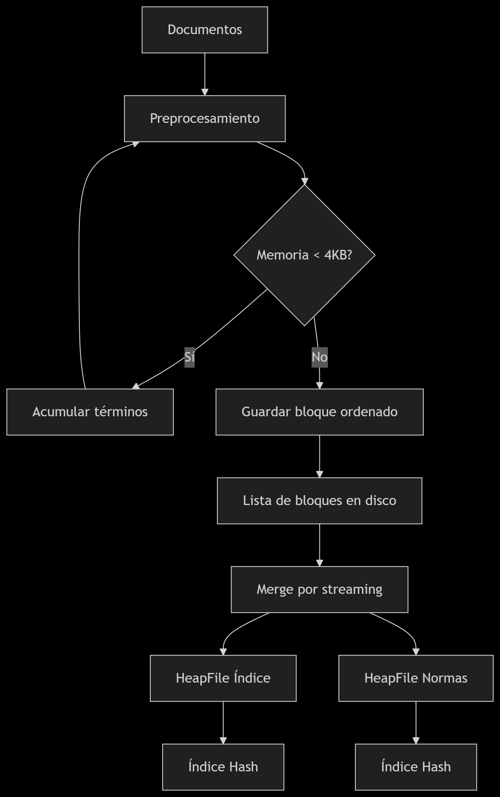

# Implementación de SPIMI

## 📌 Introducción

Esta implementación del algoritmo SPIMI (Single-Pass In-Memory Indexing) está optimizada para:
- Manejar colecciones de documentos de gran tamaño
- Minimizar el uso de memoria RAM
- Generar índices invertidos con pesos TF-IDF
- Calcular normas de documentos para búsquedas eficientes

## 🔧 Componentes Clave

### 1. Procesamiento en Streaming
```python
def _process_documents(self, table_name: str) -> None:
    heapfile = HeapFile(table_name)
    term_dict = defaultdict(lambda: defaultdict(int))
    block_number = 0
    memory_limit = 4 * 1024  # 4KB

    for doc_id, text in heapfile.iterate_text_documents():
        # Preprocesamiento y acumulación en term_dict
        if sys.getsizeof(term_dict) >= memory_limit:
            self._dump_block(term_dict, block_number)
            term_dict.clear()
```

### 2. Merge Externo con Heap
```python
def _streaming_merge_with_tfidf(self) -> None:
    heap = []
    # Inicializar heap con primer término de cada bloque
    for i, path in enumerate(block_paths):
        term, postings = next(block_iter)
        heapq.heappush(heap, (term, i))
    
    while heap:
        term, block_idx = heapq.heappop(heap)
        # Procesar término y escribir directamente a disco
```

## 📊 Diagrama de Flujo (spimi_flow.png)



## ⚙️ Proceso Detallado

### Fase 1: Procesamiento por Bloques

#### Input: Stream de documentos

Pasos:
- Tokenización y limpieza
- Acumulación en diccionario en RAM (4KB máximo)
- Ordenamiento y guardado como bloque en disco

#### Output: 
- Múltiples bloques ordenados (.pkl)

### Fase 2: Merge con TF-IDF

#### Estrategia:
- Uso de min-heap para ordenar términos entre bloques
- Cálculo incremental de TF-IDF
- Escritura directa a HeapFile final

#### Optimizaciones:
- Sólo carga términos necesarios en RAM
- Normas se calculan durante el merge

### Fase 3: Construcción de Índices

#### Índice Invertido:
- Estructura: término → [(doc_id, tfidf)]
- Serialización: JSON comprimido

#### Normas:
- Precalculadas para similitud coseno
- Almacenadas como flotantes

## 🚀 Rendimiento

| Operación     | Complejidad                   | Memoria Máxima     |
|---------------|-------------------------------|---------------------|
| Procesamiento | O(n)                          | 4 KB                |
| Merge         | O(k log k) (k = bloques)      | ~1 KB/bloque        |
| Guardado      | O(1) por término              | Término actual      |
